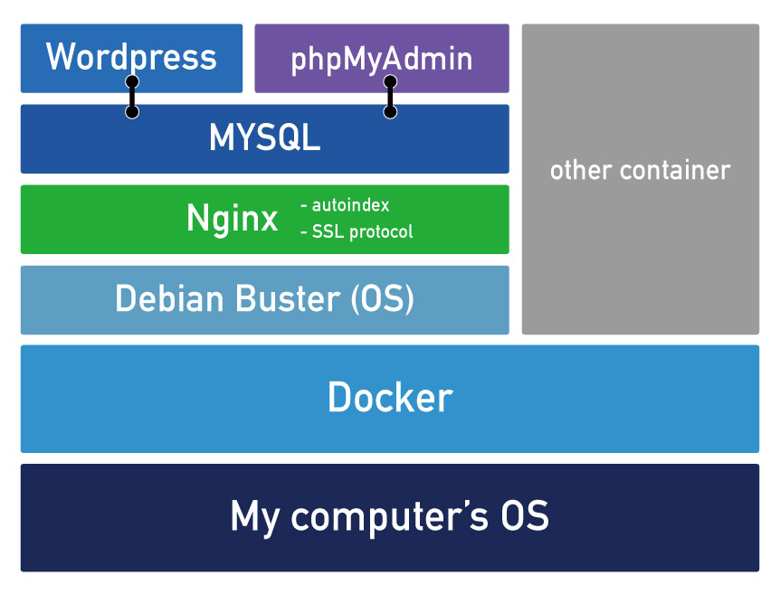

# Ft_server

## Introduction
This topic is intended to introduce you to system administration. It will make you aware
of the importance of using scripts to automate your tasks. For that, you will discover
the "docker" technology and use it to install a complete web server. This server will run
multiples services: Wordpress, phpMyAdmin, and a SQL database.

## Concept
- [x] Docker, Container
- [x] Nginx
- [x] Wordpress
- [x] phpMyAdmin
- [x] MySQL
- [x] SSL protocol
- [x] Autoindex
- [x] php-fpm

